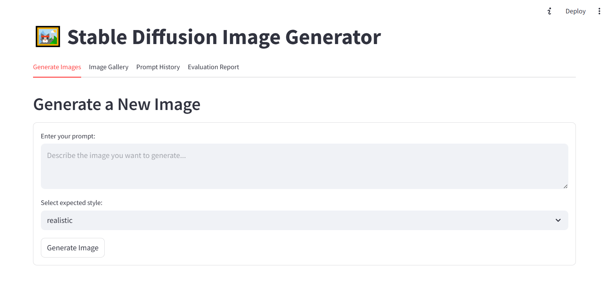
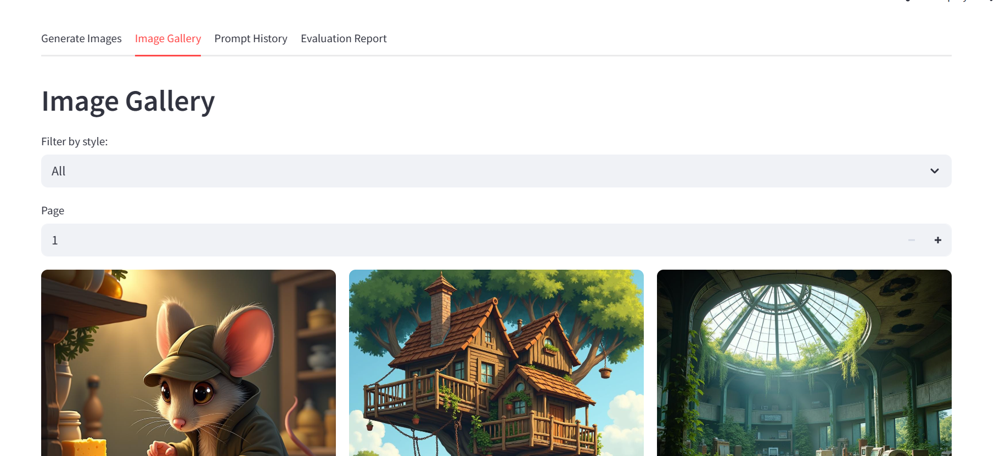
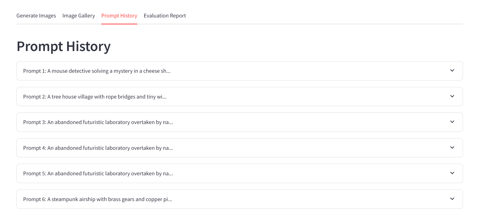
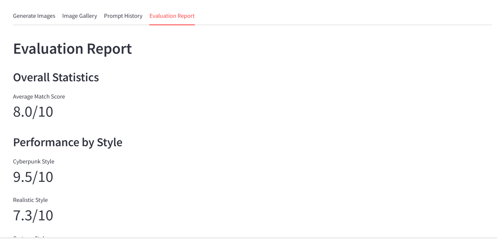

# 🖼️ Text-to-Image App

[](https://www.python.org/)
[](https://streamlit.io/)
[](https://huggingface.co/)
[](https://opensource.org/licenses/MIT)

> A Streamlit web application for generating stunning images from text prompts using Stable Diffusion via the Hugging Face API. This app allows users to select different artistic styles, maintain a gallery of generated images, rate creations, and review prompt history with detailed evaluation reports.



---

## ✨ Features

- **🎨 Text-to-Image Generation:** Enter a prompt and generate high-quality images using Stable Diffusion.
- **🔄 Style Selection:** Choose from "realistic", "cyberpunk", or "cartoon" styles (styles are applied via prompt engineering).
- **📱 Responsive UI:** Clean, intuitive interface designed for ease of use.
- **🖼️ Image Gallery:** Browse, download, and delete previously generated images.
- **📜 Prompt History:** Review all prompts and their generated images for reference.
- **⭐ Evaluation System:** Rate images and provide feedback; view comprehensive evaluation statistics.
- **⚡ Rate Limiting:** Prevents excessive API usage to stay within free tier limits.
- **💾 Local Database:** Stores prompts, images, scores, and feedback using SQLite.
- **🔄 Demo Mode:** Returns a placeholder image if the API token is missing or invalid.

---

## 📱 Application Screenshots

### Generate Images


### Image Gallery


### Prompt History


### Evaluation Reports


---

## 🚀 Setup & Installation

### 1. Clone the Repository

```sh
git clone https://github.com/iammuhammadfurqan/stable_diffusion_image_gen.git
cd text-to-image-app
```

### 2. Create Virtual Environment (Optional but Recommended)

```sh
python -m venv venv
# On Windows
venv\Scripts\activate
# On macOS/Linux
source venv/bin/activate
```

### 3. Install Dependencies

```sh
pip install -r requirements.txt
```

### 4. Configure Secrets

Create a `.streamlit/secrets.toml` file and add your Hugging Face API token:

```toml
HUGGING_FACE_API_TOKEN = "your_huggingface_api_token"
```

> 📝 You can get a free API token by creating an account at [Hugging Face](https://huggingface.co/).

### 5. Run the App

```sh
streamlit run app.py
```

The app will be available at `http://localhost:8501` in your web browser.

---

## 📖 Usage Guide

1. **Generate Images**:
   - Enter a descriptive prompt in the "Generate Images" tab
   - Select a style (realistic, cyberpunk, or cartoon)
   - Click "Generate Image" to create and view your image

2. **Manage Gallery**:
   - Browse all generated images in the "Image Gallery" tab
   - Download images to your device
   - Delete unwanted images

3. **Review History**:
   - See all previous prompts and their corresponding images
   - Track your creative journey

4. **Evaluate**:
   - Rate images on a scale of 1-5 stars
   - Provide detailed feedback for future improvements
   - View evaluation statistics and reports

---

## 📁 File Structure

```
text-to-image-app/
│
├── app.py                    # Main Streamlit application
├── requirements.txt          # Python dependencies
├── .streamlit/
│   └── secrets.toml          # API credentials (create this)
├── generated_images/         # Folder for storing generated images
├── image_generator.db        # SQLite database for prompts and metadata
└── .gitignore                # Ensures sensitive files are not tracked
```

---

## 🔍 Technical Details

- The app uses the `stabilityai/stable-diffusion-xl-base-1.0` model via Hugging Face's API
- Style variations are created through prompt engineering rather than different models
- SQLite database manages persistent storage of all user data and generated content
- Streamlit components provide a responsive and interactive user interface
- Rate limiting ensures API usage stays within acceptable bounds

---

## ⚠️ Limitations

- API rate limits may restrict the number of images generated per day on the free tier
- Image generation typically takes 5-15 seconds depending on server load
- Image quality and accuracy depend on the clarity and specificity of the prompt

---

## 📄 License

This project is licensed under the MIT License - see the [MIT License](https://opensource.org/licenses/MIT) for details.

---

## 🙏 Acknowledgments

- [Streamlit](https://streamlit.io/) for the amazing web app framework
- [Hugging Face](https://huggingface.co/) for providing accessible AI APIs
- [Stable Diffusion](https://stability.ai/) for the incredible image generation model

---